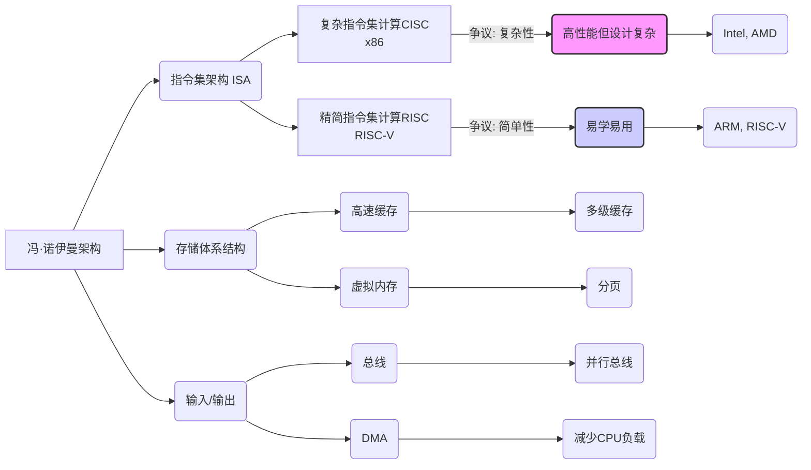

# CS61C 计算机体系结构导论 学习笔记

## 1. 课程脉络

### 时间轴

- **第一讲**:
    - **课程介绍**：课程目标、教师和助教团队、课程资源、评分政策、迟交政策、学术诚信。
    - **核心概念**：机器结构、计算机体系结构的伟大思想。
    - **数字表示**：二进制、十进制、十六进制转换，有符号数表示（原码、反码、补码）、偏置编码 (Bias Encoding)。
    - **关键学者**: Nick Weaver, Connor McMahon, Zoe Plaxco, Justin Yokota, Jerry Xu。

## 2. 理论框架

### 核心模型分层解析

1. **抽象 (Abstraction)**：
    
    - **基础假设**：计算机系统通过多层抽象来管理复杂性。每一层都隐藏了下层的细节，仅向上层提供必要的接口。
    - **数学表达**：抽象本身不直接涉及数学公式，但它体现了一种层次化的信息组织方式。
    - **应用场景**：
        - 高级语言（如 C）通过编译器转换为汇编语言。
        - 汇编语言通过汇编器转换为机器语言。
        - 机器语言被硬件架构（如电路图）解释执行。
        - 每层抽象都为上层提供接口，简化复杂性。
2. **摩尔定律 (Moore's Law, Moore 1965)**：
    
    - **基础假设**：集成电路上可容纳的晶体管数量，约每两年增加一倍。
    - **数学表达**: 虽然摩尔定律本身不是一个精确的数学公式，但它可以用指数函数近似描述：

       $N(t) = N_0 * 2^{(t/2)}$  
    其中 N(t) 是 t 年时的晶体管数量， N_0 是初始晶体管数量。

    - **应用场景**：
        - 指导芯片设计，推动技术发展。
        - 最初导致单任务性能提升，现在更多地推动并行计算的发展。
3. **局部性原理 (Principle of Locality) / 存储层次 (Memory Hierarchy)**：
    
    - **基础假设**：程序访问的数据和指令在时间和空间上都具有局部性。
    - **数学表达**：局部性原理本身没有数学表达式，但它指导了存储层次的设计，以最小化数据访问的平均延迟。
    - **应用场景**：
        - 存储层次结构包括高速缓存 (cache)、主存储器、磁盘等，以减少数据访问的延迟。
        - 利用局部性原理，将最常访问的数据放在最快的存储器中。
4. **并行性 (Parallelism) & 阿姆达尔定律 (Amdahl's Law, Amdahl 1967)**：
    
    - **基础假设**：通过同时执行多个操作来提高计算性能。
    - **数学表达**：阿姆达尔定律限制了并行加速的上限：
        
          $$S(n) = \frac{1}{(1-P) + \frac{P}{n}}$$

        其中 S(n) 是使用 n 个处理器获得的加速比，P 是可并行化的部分。

    - **应用场景**：
        - 多核处理器、GPU、数据并行处理等，提高计算效率。
    - 尽管并行性很重要，但并非所有程序都可以完美并行化。
5. **通过冗余实现可靠性 (Dependability via Redundancy)**：
    
    - **基础假设**：通过引入冗余组件来提高系统的可靠性和容错性。
    - **数学表达**：冗余可以通过多种形式实现，例如：
        - N-模冗余（N-Modular Redundancy）：使用多个相同的组件，并通过投票机制来确定结果。
        - 奇偶校验：在数据中添加额外的校验位，以检测错误。
    - **应用场景**：
        
        - 数据中心中的冗余服务器和存储设备。
        - RAID 磁盘阵列。
        - ECC 内存。
        - 冗余教师。

        > [!quote] **Nick Weaver 强调，冗余性适用于从数据中心到教师的各个方面**

## 3. 学术图谱

### 计算机体系结构领域发展树形图

## 4. 案例精析

### [RISC-V 指令集架构]

- **背景条件**：传统指令集架构（如 x86）过于复杂，不利于教学和研究。
- **分析方法**：采用精简指令集（RISC）设计理念，简化指令集，提高执行效率。
- **结论启示**：RISC-V 成为一个开源的硬件替代方案，在学术界和工业界被广泛接受。

> [!note] 相关论文推荐: Waterman, A., Lee, Y., Asanovic, K., & Patterson, D. A. (2016). The RISC-V instruction set manual (Vol. 1).

### [Google 的数据中心]

- **背景条件**：数据中心需要高可靠性和高可用性。
- **分析方法**：通过冗余技术来提高系统的容错能力，包括冗余服务器、冗余磁盘 (RAID)、和冗余数据中心。
- **结论启示**：冗余是构建高可靠性系统的关键，即使硬件失效，服务也能正常运行。

    > [!note] 相关论文推荐: Barroso, L. A., & Hölzle, U. (2009). The datacenter as a computer: an introduction to the design of warehouse-scale machines. Synthesis Lectures on Computer Architecture, 4(1), 1-120.

### [Valgrind 内存调试工具]

- **背景条件**：C 语言的内存管理不安全，容易产生内存泄漏和段错误等问题。
- **分析方法**：Valgrind 可以动态分析程序的内存使用情况，检测内存错误。
- **结论启示**：使用 Valgrind 可以帮助程序员定位和修复内存问题，确保代码的正确性。

    > [!note] 相关论文推荐: Nethercote, N., & Seward, J. (2007). Valgrind: a framework for heavyweight dynamic binary instrumentation. ACM SIGPLAN Notices, 42(10), 89-100.

## 5. 思辨空间

### 课堂讨论关键辩题

| 辩题             | 正方观点                                                     | 反方观点                                         |
| ---------------- | ------------------------------------------------------------ | ------------------------------------------------ |
| **CISC vs RISC** | CISC 指令复杂，功能强大，易于编写汇编代码                    | RISC 指令简单，易于硬件实现，执行效率更高        |
| **作弊惩罚力度** | 严厉惩罚作弊行为，以维护学术诚信                             | 过度严厉的惩罚可能会导致学生不敢寻求帮助。       |
| **课程难度**     | 课程内容丰富，涵盖计算机体系结构的核心概念，对学生要求较高。 | 课程难度过高可能导致学生压力过大，影响心理健康。 |
| **是否需要买书** | 建议购买教材，以便深入学习课程内容                           | 可以租用教材或使用在线资源，不必强制购买。       |
| **线上学习**     | Zoom 可以提高互动性，方便提问                                | 线上学习可能导致学生注意力分散，难以专注学习。   |

## 增值模块

### 1. 认知脚手架

- **知识迁移地图**：
    - **理论层面**：将抽象、并行性、冗余等概念应用于软件、硬件、系统设计。
    - **实践层面**：将 C 语言、RISC-V 汇编、Logisim 等工具应用于实际的项目开发。
    - **现实层面**：通过理解计算机体系结构，可以更好地理解和使用计算机系统。
    - 例如，理解存储层次可以优化程序性能，理解并行性可以编写高效的并行程序。

### 2. 学术预警系统

- **高频考点**：
    - **★ ★ ★ ★** 二进制、十六进制转换，补码表示，溢出
    - **★ ★ ★** 存储层次结构，并行性概念
    - **★ ★** 抽象的概念，摩尔定律的影响， 冗余的意义
- **常见论证误区**：
    - **以偏概全**：不能因为 RISC-V 在某些方面比 x86 好就认为 RISC-V 在所有方面都优于 x86。
    - **过度简化**：不能认为并行化可以解决所有性能问题，阿姆达尔定律限制了并行加速的上限。
    - **逻辑谬误**：不能认为只要努力学习就能保证不作弊，学术诚信需要严格遵守规则。

### 3. 教授思维透视

- **论证偏好**：
    - **Nick Weaver** 教授强调安全，并将其融入到课程的各个方面。
    - 他倾向于将计算机系统视为一个需要工程化设计的复杂系统，而非仅仅是技术实现。
    - 他还强调实际动手能力，鼓励学生使用 Valgrind 等工具进行调试。
- **学术倾向**:
    - Nick Weaver 教授对网络安全和硬件安全有浓厚兴趣。
    - 他倾向于采用实用主义的视角看待计算机体系结构。

### 彩虹表格：易混淆概念对比

| 概念 | 定义                                           | 代表人物 | 典型应用                                     |
| ---- | ---------------------------------------------- | -------- | -------------------------------------------- |
| 原码 | 最高位表示符号，其余位表示数值                 |          | 直接表示有符号数，但运算复杂                 |
| 反码 | 正数与原码相同，负数符号位不变，其余位按位取反 |          | 常用于中间转换，运算复杂                     |
| 补码 | 正数与原码相同，负数反码加1                    |          | 现代计算机中表示有符号数的标准方法，运算简便 |
