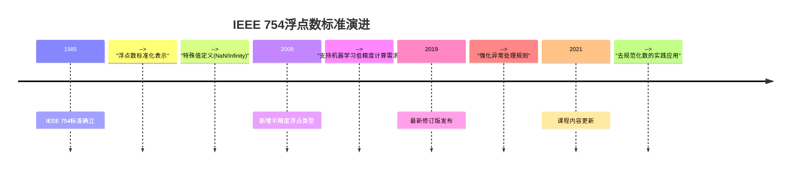
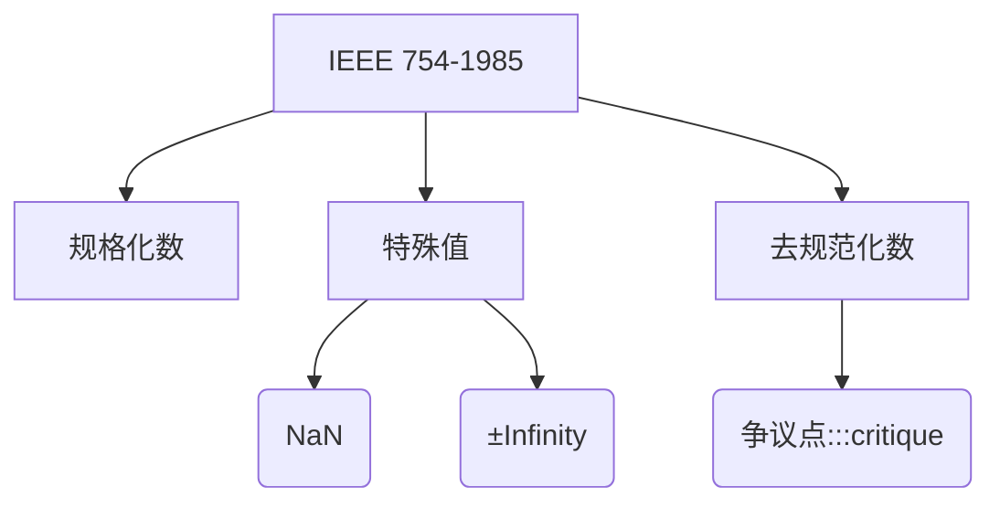

## 1. 课程脉络  

### 时间轴与知识演进  

**关键学者关联**：  
- **McMahon & Weaver**：强调[←指数偏置→]与[←去规范化数→]的硬件实现关联  

---

## 2. 理论框架  

### 浮点数核心模型  

#### 基础假设  

> [!quote]  
> "浮点数的核心矛盾是有限精度与无限实数的映射关系" —— McMahon, 2021  

#### 数学表达（IEEE 754 单精度）  

- **结构公式**：  

  $$

  (-1)^S \times 1.\text{Mantissa} \times 2^{\text{Exponent}-127}  

$$
  

  - **符号位**（1bit）： $S=0$ 为正， $S=1$ 为负  
  - **指数偏置**： $E_{\text{biased}} = E + 127$ （避免符号位干扰比较）  
  - **隐式前导 1**：规格化数隐含 `1.xxx` ，去规范化数隐含 `0.xxx`  

#### 应用场景  

| 类型        | 定义         | 典型应用                    |     
| --------- | ---------- | ----------------------- | 
| **NaN**   | 指数全 1，尾数非零 | 无效运算结果（如 $\sqrt{-1}$ ）  |     
| **去规范化数** | 指数全 0，尾数非零 | 填补 $[0, 2^{-126}]$ 精度真空 |     

---

## 3. 学术图谱  

**学派争议**：  
- **支持去规范化数**：避免下溢归零（如科学计算微小量）  
- **反对观点**：增加硬件复杂度（如 Intel 早期 FPU 兼容性问题）  

---

## 4. 章节精析  

### 4.1 指数偏置表示  

**数学原理**：  
- **偏置公式**： $E_{\text{biased}} = E + 127$  
- **比较优势**：直接使用无符号整数比较指令（如 `CMP` ）  

> [!important]  
> 偏置指数使 $E_{\text{biased}} \in [1,254]$ 对应实际指数 $E \in [-126,127]$  

### 4.2 去规范化数  

**编码规则**：  
$$

(-1)^S \times 0.\text{Mantissa} \times 2^{-126}  

$$
  

- **最小正数**： $2^{-149}$ （尾数最低位为 1）  
- **与规格化数对比**：  

  | 特征 | 规格化数 | 去规范化数 |
  |-------|---------- |------------|
  | 隐式前导位 | 1  | 0 |
  | 指数范围 | 1-254 | 0 |

---

## 5. 思辨空间  

### 浮点运算不可结合性  

**实验案例**：  
- 输入： $X = -1.5 \times 10^{38},\ Y = 1.5 \times 10^{38},\ Z = 1.0$  
- 结果：  

  
$$

  (X + Y) + Z = 1.0 \quad \text{vs} \quad X + (Y + Z) = 0  

$$  

**争议矩阵**：  
| 支持方观点 | 反对方观点 |
|------------|------------|
| "反映真实计算误差" | "破坏代数基本定律" |
| 适用科学仿真 | 需显式误差控制 |

---

## 增值模块  

### 1. 学术预警系统  
**高频考点（★★★★★）**：  
- 单精度浮点数范围： $±[2^{-126}, (2-2^{-23}) \times 2^{127}]$  
- **常见误区**：误认为 `0.1 + 0.2 == 0.3` 在浮点运算中成立  

### 2. 教授思维透视  
**McMahon & Weaver 倾向性**：  
- **设计哲学**：优先保证跨平台一致性（vs. 追求极致性能）  
- **教学特色**：通过工具链（如 [Float Converter](https://www.h-schmidt.net/FloatConverter/IEEE754.html)）强化直观理解  

**附录**  
| 概念 | 定义 | 易混淆点 |  
|------|------|----------|  
| **NaN** | 非数值标记 | 与 Infinity 编码差异（尾数是否为零） |  
| **偏置指数** | 无符号化处理 | 实际指数=存储值-127 |
