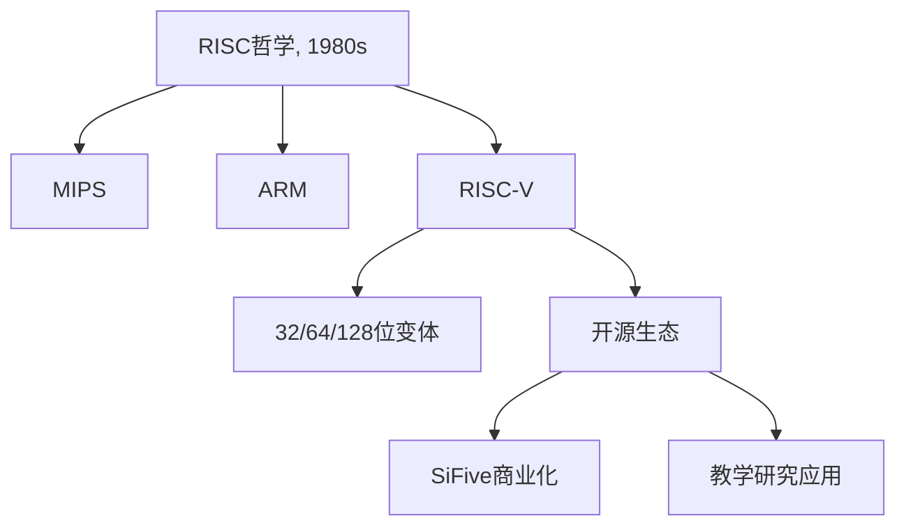

# lec07-RISCV指令基础 1-学习笔记

## 1. 课程脉络  

### 时间轴与主题演进  

| 日期       | 主题                                                                 | 关键学者/贡献                     |  
|------------|----------------------------------------------------------------------|-----------------------------------|  
| 1980s      | RISC架构诞生（简化指令集哲学）                                       | Cocke (IBM), Patterson & Hennessy |  
| 2010       | RISC-V开源项目启动（支持教学与研究）                                 | Krste Asanović (UC Berkeley)      |  
| 2022       | RISC-V指令集详解（寄存器、内存访问、分支控制）                       | McMahon & Weaver                  |  

>[!tip] 跨章节关联：  

- **寄存器与内存速度差异** [←链接→ 第11页] → **指针算术与数组访问** [←链接→ 第28-32页]  
- **立即数符号扩展** [←链接→ 第39页] → **字节加载与符号扩展机制** [←链接→ 第35-38页]  

---

## 2. 理论框架  

### RISC-V核心模型分层解析  

| 层级          | 基础假设                     | 数学表达/逻辑                          | 应用场景             |  
|---------------|------------------------------|----------------------------------------|----------------------|  
| **指令集**    | 精简指令（单周期操作）       | 指令格式：`opcode rd, rs1, rs2`        | 硬件优化设计         |  
| **寄存器**    | 32个32位寄存器（x0-x31）     | 寄存器操作：`add x1, x2, x3`           | 临时数据快速存取     |  
| **内存访问**  | 字节寻址（地址对齐）         | 地址计算：`lw x10, 12(x15)`            | 数组/结构体操作      |  
| **控制流**    | 条件分支与标签跳转           | 分支条件：`bne x10, x11, Label`        | 循环与条件判断       |  

**关键公式**：  
- 左移乘法：

$$
 \text{slli } x10, x11, n \Rightarrow x10 = x11 \times 2^n 
$$  

- 算术右移符号保留：

$$
 \text{srai } x10, x11, n \Rightarrow x10 = \left\lfloor \frac{x11}{2^n} \right\rfloor \text{（向负无穷舍入）} 
$$  

---

## 3. 学术图谱  

### RISC发展树形图  



**学派争议点**：  
- <span style="color:red">符号扩展策略</span>：RISC-V采用符号扩展（`lb`）与零扩展（`lbu`）双模式，与x86的单一模式对比  
- <span style="color:blue">分支指令冗余性</span>：RISC-V未定义`bgt`，依赖伪指令转换（`bgt x1, x2, L` → `blt x2, x1, L`）  

---

## 4. 章节精析  

### 4.1 寄存器与内存  

**核心内容**：  
- **寄存器**：32个32位寄存器（x0固定为0），操作速度比内存快50-500倍（第11页）。  
- **内存访问**：字节寻址需4位地址（16字节），字寻址需2位地址（4字）（第24-25页）。  

**代码示例**：  

```asm  
addi x9, x0, 0x3F5   # x9 = 0x000003F5  
sw x9, 0(x5)         # 存储到内存地址x5  
lb x10, 1(x5)        # 加载字节：x10 = 0xFFFFFF03（符号扩展）  
```  

### 4.2 控制流与分支  

**核心内容**：  
- **条件分支**：`beq`/`bne`用于相等性判断，`blt`/`bge`用于有符号比较（第51-55页）。  
- **循环实现**：通过标签跳转与计数器管理（第59页）。  

**代码示例**：  

```asm  
Loop:  
    bge x11, x13, Done   # 若i >= 20，跳转至Done  
    lw x12, 0(x9)        # 加载A[i]  
    addi x9, x9, 4       # 指针递增（int为4字节）  
    j Loop               # 无条件跳转  
Done:  
```  

---

## 5. 思辨空间  

### 关键辩题：**符号扩展的合理性**  

| 正方观点                           | 反方观点                           |  
|------------------------------------|------------------------------------|  
| 符号扩展保留数值语义一致性（第35页） | 零扩展更符合无符号数据处理需求     |  
| 硬件实现简单，减少电路复杂性       | 增加程序员心智负担（需区分lb/lbu） |  

---

## 增值模块  

### 1. 认知脚手架：知识迁移地图  

| 理论概念               | 现实应用场景                     |  
|------------------------|----------------------------------|  
| **寄存器优化**         | 嵌入式系统实时数据处理           |  
| **内存地址计算**       | 操作系统内存管理（页表寻址）     |  
| **条件分支**           | 编译器优化（循环展开与预测）     |  

### 2. 学术预警系统  

| 高频考点（★★★）        | 常见误区（★级）                  |  
|------------------------|----------------------------------|  
| 立即数符号扩展机制     | 混淆`srai`与`slli`的舍入方向     |  
| 指针算术与数组访问     | 未考虑字节对齐导致内存访问错误   |  

### 3. 教授思维透视  

- **论证偏好**：强调硬件-软件协同设计（如RISC-V精简指令集对编译器优化的支持）。  
- **学术倾向**：推崇开源架构（RISC-V）在教育与产业中的潜力，批评x86复杂度（第6页）。  

>[!seealso]+ **扩展阅读**  
> 1. Patterson & Hennessy. (2017). *Computer Organization and Design: RISC-V Edition*.  
> 2. Waterman, A. (2016). *The RISC-V Instruction Set Manual*.  

---
