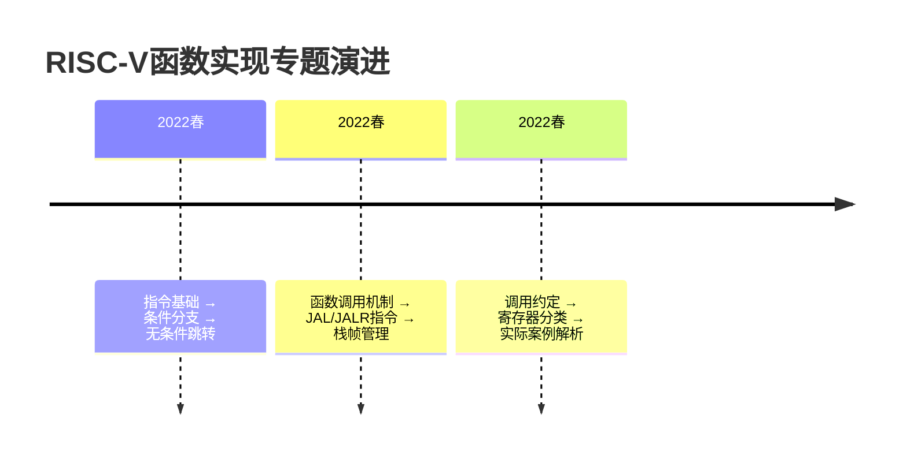
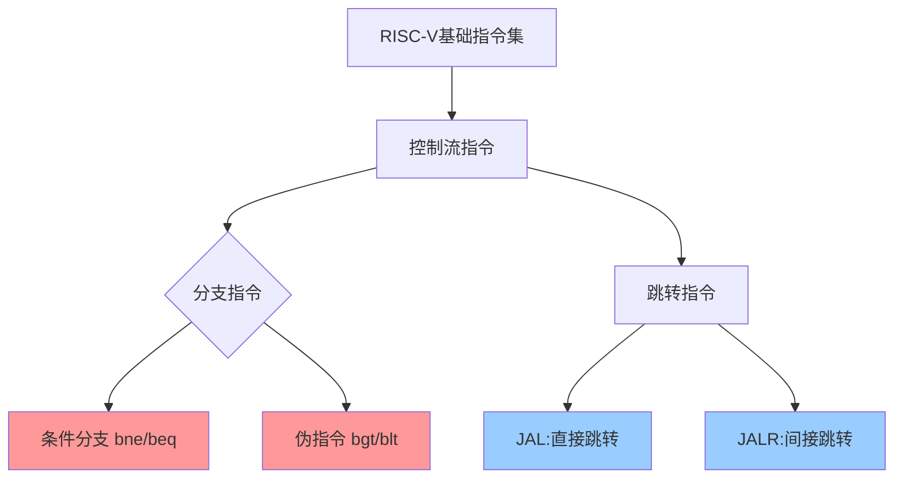
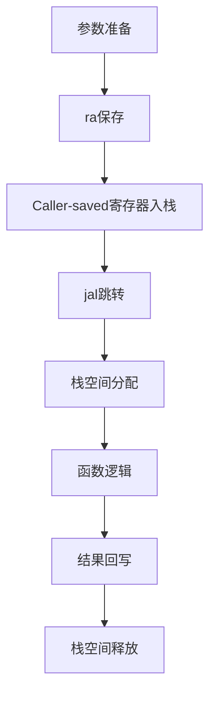

# lec07-RISCV指令基础 2-学习笔记

## 1. 课程脉络



>[!tip] 关键关联：

- `条件分支[←P4]` → `函数跳转[←P10]`
- `栈指针[←P28]` → `调用约定[←P35]`

## 2. 理论框架

### 基础假设

1. 寄存器存储模型：32位通用寄存器可存指针/整型数据（P2）
2. 程序计数器(PC)线性增长机制：`PC_next = PC_current + 4`（P9）
3. 冯诺依曼架构下指令-数据统一编址

### 数学表达

- **JAL指令公式**：

  $$

\text{PC} \leftarrow \text{PC} + \text{offset} \\  
  \text{rd} \leftarrow \text{PC} + 4

$$
  > 20位偏移量支持±1MB跳转范围（P11）

- **栈操作公式**：
$$

  \text{PUSH: } sp \leftarrow sp - n \times 4 \\  
  \text{POP: } sp \leftarrow sp + n \times 4 

$$
  > 4字节对齐原则（P32）

### 应用场景
| 指令类型 | 典型用例          |
| -------- | ----------------- |
| `bne`    | 循环控制（P7）    |
| `jal`    | 函数调用（P23）   |
| `sw`     | 寄存器保存（P33） |

## 3. 学术图谱


## 4. 章节精析
### 4.1 条件分支实现
- **核心机制**：通过比较寄存器值决定PC跳转
- **关键创新**：`bge`替代`bgt`的指令精简设计（P4）
```riscv
# if-else实现范例
bne x10,x11,else
add x14,x12,x13   // true分支
j done
else: sub x14,x12,x13
```

### 4.2 函数调用规范
- **调用六步法**（P46）：
  1. 参数传递 → 2. 控制转移 → 3. 栈分配
  4. 函数执行 → 5. 结果返回 → 6. 上下文恢复

- **调用约定矩阵**：

| 寄存器类型   | 保存责任方 | 典型代表     | 意义                                                                     |
| ------------ | ---------- | ------------ | ------------------------------------------------------------------------ |
| Caller-saved | 调用者     | a0-a7, t0-t6 | 由 caller 保存，向 callee 传递参数，方便 callee 执行函数功能             |
| Callee-saved | 被调者     | s0-s11, sp   | 由 callee 保存，维护 caller 想要的值，从而返回后 caller 可以正常执行函数 |

>[!quote] 教师强调：
> "调用约定是函数协作的宪法，破坏约定将导致寄存器污染灾难"（P35）

### 4.3 栈帧管理
- **内存布局**：
  ```
  0x00010000 [Text段]
  0x10000000 [Static Data]
  0xBFFFFFF0 [Stack]
  ```
- **典型操作**：
```riscv
addi sp,sp,-8    // 分配8字节栈空间
sw s0,0(sp)      // 保存寄存器
lw s0,0(sp)      // 恢复寄存器
```


### 4.4 Calling Convention
>[!important]+
| >       | Register | Name                             | Description | Saved by |
| ------- | -------- | -------------------------------- | ----------- |
| x0      | zero     | Always Zero                      | N/A         |
| x1      | ra       | Return Address                   | Caller      |
| x2      | sp       | Stack Pointer                    | Callee      |
| x3      | gp       | Global Pointer                   | N/A         |
| x4      | tp       | Thread Pointer                   | N/A         |
| x5-7    | t0-2     | Temporary                        | Caller      |
| x8-x9   | s0-s1    | Saved Registers                  | Callee      |
| x10-x17 | a0-7     | Function Arguments/Return Values | Caller      |
| x18-27  | s2-11    | Saved Registers                  | Callee      |
| x28-31  | t3-6     | Temporaries                      | Caller      |
>逐行解释：
>x0: 恒 0
>x1：返回的地址（Return Address）
>   1. 由 caller 保存交给 callee 使用，是 callee 结束生命周期后返回的地址。
>   2. callee 在开始时需保存 caller 传过来的 ra，防止 callee 内部有函数调用（callee 此时成了下一级的 caller）将 ra 覆写找不回 ra
>  
>x2：用于恢复想要保存但可能被覆写的值的地方
>a0-7: caller 用来传递参数的地方。a0-1 一般放返回值
>t0-6：caller 想要保存参数的地方，由 caller 借助 x2 维护
1. **Caller-Saved (临时寄存器)**：
    - `t0` 到 `t6`
    - 这些寄存器用于存储临时变量或中间结果。
    - 如果调用者（caller）在调用另一个函数之前使用了这些寄存器，并且希望在调用返回后还能使用这些值，那么调用者必须在调用前将这些寄存器的内容保存到栈中。
2. **Callee-Saved (已保存寄存器)**：
    
    - `s0` 到 `s11`
    - 这些寄存器通常用于存储需要长期保存的变量或指针。
    - 被调用者（callee）如果使用了这些寄存器，必须在函数返回前将它们恢复到原始值。

例子：
```c++

int bar(int g, int h, int i, int j) { 
	int f = (g + h) - (i + j); 
	return f; 
} 	

int foo(int x) { 	
	// do stuff 
	int x = bar(g, h, i, j); 
	return (x * 2); 
} 

int main() { 
	// do stuff 
	foo(x); 
	// do stuff 
}
```
```assembly
.data
g: .word 10        # 假设全局变量默认值
h: .word 20
i: .word 5
j: .word 5

.text
.global main

# int bar(int g, int h, int i, int j)
bar:
    add t0, a0, a1   # t0 = g + h (a0-a3存储参数)
    add t1, a2, a3   # t1 = i + j
    sub a0, t0, t1   # 返回值存a0
    ret

# int foo(int x)
foo:
    # 保存返回地址（非叶函数）
    addi sp, sp, -8
    sw ra, 4(sp)
    sw a0, 0(sp)     # 保存参数x（若需要）
    
    # 准备bar的参数：g=x, h, i, j
    mv a0, a0        # a0 = x（显式传递，可省略）
    la t0, h         # 加载h到a1
    lw a1, 0(t0)
    la t0, i
    lw a2, 0(t0)     # 加载i到a2
    la t0, j
    lw a3, 0(t0)     # 加载j到a3
    
    jal bar           # 调用bar
    
    slli a0, a0, 1   # 结果乘2（a0 << 1）
    
    lw ra, 4(sp)     # 恢复返回地址
    addi sp, sp, 8
    ret

main:
    addi sp, sp, -8
    sw ra, 0(sp)
    
    # 设置foo参数x=7（示例值）
    li a0, 7         # 假设调用foo(7)
    jal foo
    
    # ...后续操作...
    
    lw ra, 0(sp)
    addi sp, sp, 8
    ret
```
 
## 5. 思辨空间
### 关键辩题：Caller-saved vs Callee-saved寄存器划分合理性
| 观点维度 | 支持方               | 反对方               |
| -------- | -------------------- | -------------------- |
| 性能优化 | 减少不必要的保存操作 | 增加调用开销         |
| 代码安全 | 明确责任边界         | 增加实现复杂度       |
| 硬件支持 | 匹配流水线特性       | 限制寄存器使用灵活性 |

## 增值模块
### 认知脚手架：函数调用安全模式


### 学术预警系统
| 高频考点    | 频次 | 常见错误示例           |
| ----------- | ---- | ---------------------- |
| JAL指令原理 | ★★★  | 混淆rd与目标地址关系   |
| 调用约定    | ★★★★ | 误用Caller-saved寄存器 |
| 栈对齐要求  | ★★   | push/pop次数不匹配     |

### 教授思维透视
- **论证偏好**：
  - 强调`硬件-软件协同设计`理念（见P7循环案例）
  - 注重`最小完备指令集`哲学（P15伪指令设计）
- **学术倾向**：
  - 推崇`分层解耦`的系统观（P35调用约定设计）
  - 警惕`隐式状态依赖`（P25寄存器保存必要性）

>[!seealso]+ 扩展阅读
> 1. Patterson & Hennessy《计算机组成与设计》RISC-V版第2章
> 2. RISC-V官方规范手册Chapter 25 (Control Transfer)
> 3. CS61C课程实验3：Function Calling Convention

标题：分支指令对比矩阵

| 指令 | 类型     | 比较条件   | 典型应用     |
| ---- | -------- | ---------- | ------------ |
| beq  | 条件分支 | 寄存器相等 | 循环终止判断 |
| bge  | 条件分支 | 有符号≥    | 数组边界检查 |
| jal  | 跳转链接 | 绝对地址   | 函数调用     |
| jalr | 跳转链接 | 寄存器基址 | 虚函数调用   |
|      |          |            |              |

# RISC-V 函数与指令总结

---

## RISC-V 指令

### 条件分支
- **用途**：实现 `if-else`、循环等控制流。
- **格式**：`{comparison} {reg1} {reg2} {label}`  
  - 支持指令：`beq`, `bne`, `blt`, `bge` 等。
  - **无直接 `<=` 或 `>`**：需通过参数调换实现，例如：
    ```assembly
    # A > B 等价于 B < A
    blt x11, x10, Label
    ```

### 无条件分支
- **跳转指令**：
  - `j Label`：直接跳转到标签位置（等价于 `jal x0, Label`）。
  - `jal rd, Label`：跳转并保存返回地址到 `rd`（默认 `ra`）。
- **伪指令**：
  - `ret` = `jalr x0, ra, 0`：从函数返回。

### JAL/JALR
- **JAL**：
  ```assembly
  jal ra, Label   # 跳转到 Label，返回地址存入 ra
  ```
- **JALR**：
  ```assembly
  jalr rd, rs, imm  # PC = [rs] + imm，返回地址存入 rd
  ```
  - 用于动态跳转（如函数指针）。

---

## 函数调用与堆栈管理

### 调用约定
- **Caller 责任**：保存临时寄存器（`t0-t6`, `a0-a7`）和 `ra`。
- **Callee 责任**：保存被保存寄存器（`s0-s11`）和 `sp`。

### 栈帧与SP操作
- **栈指针（SP）**：寄存器 `x2`，指向栈顶。
- **操作**：
  ```assembly
  addi sp, sp, -8   # 分配栈空间（压栈）
  sw s0, 0(sp)      # 保存寄存器到栈
  lw s0, 0(sp)      # 恢复寄存器
  addi sp, sp, 8    # 释放栈空间（弹栈）
  ```
- **栈帧结构**：
  ```
  | 保存的 s1  |
  | 保存的 s0  | ← sp
  ```

---

## 寄存器用途与保存规则

### 寄存器分类
| 寄存器 | 名称 | 描述            | 保存责任 |
| ------ | ---- | --------------- | -------- |
| x1     | ra   | 返回地址        | Caller   |
| x2     | sp   | 栈指针          | Callee   |
| x5-7   | t0-2 | 临时寄存器      | Caller   |
| x10-17 | a0-7 | 函数参数/返回值 | Caller   |
| x8-9   | s0-1 | 被保存寄存器    | Callee   |

### 保存责任
- **Caller-Saved**：临时寄存器和参数寄存器（如 `t0-t6`, `a0-a7`）。
- **Callee-Saved**：被保存寄存器（如 `s0-s11`）和 `sp`。

---

## 关键代码示例

### 条件分支示例
```assembly
# if (a == b) e = c + d; else e = c - d;
bne x10, x11, else
add x14, x12, x13
j done
else: sub x14, x12, x13
done:
```

### 循环示例
```assembly
# for (i=0; i<20; i++) sum += A[i]
add x10, x0, x0      # sum = 0
add x11, x0, x0      # i = 0
loop:
    bge x11, x13, Done
    lw x12, 0(x9)    # 加载 A[i]
    add x10, x10, x12
    addi x9, x9, 4   # 移动数组指针
    addi x11, x11, 1 # i++
    j loop
Done:
```

### 函数调用示例
```assembly
# 调用函数 bar(g, h, i, j)
addi sp, sp, -4
sw ra, 0(sp)         # 保存返回地址
add a0, s0, x0       # 参数传递
jal ra, bar
lw ra, 0(sp)         # 恢复返回地址
addi sp, sp, 4
jr ra                # 返回
```

---

## 关键概念
1. **程序计数器（PC）**：
   - 每条指令执行后自动递增 `PC += 4`（32位指令）。
   - 跳转指令直接修改 `PC`。
2. **伪指令实现**：
   - `j Label` → `jal x0, Label`
   - `ret` → `jalr x0, ra, 0`
3. **内存布局**：
   ```
   高地址 → Stack
          ↓
          Dynamic Data
          Static Data
          Text (代码段)
   低地址 → Reserved
   ```
